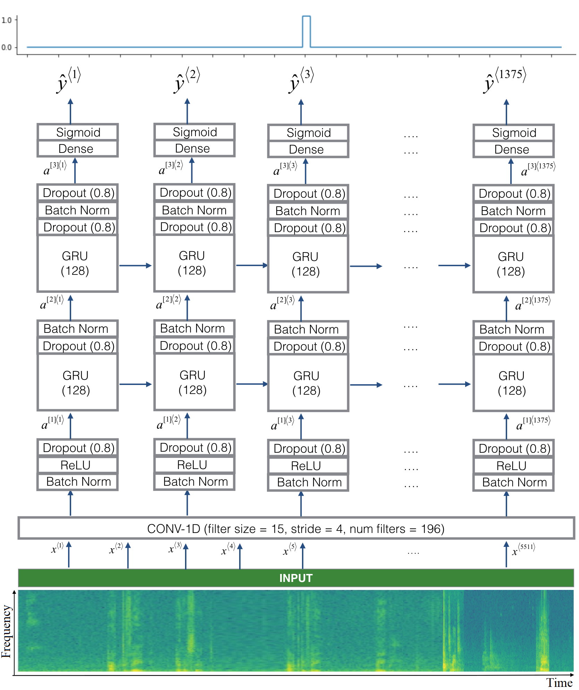
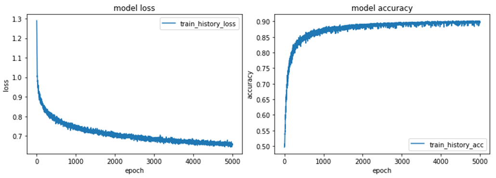

# Trigger_Word_Detection
uni-directional RNN with 2 GRU layers to detect Trigger Word.  
Andrew Ng deeplearning.ai course project accomplishment  
  
sample : 10 second  44,100 Hz  
### Read the wave file
#### scipy.io.wavfile.read(wav_file)  
### Calculate and plot spectrogram for a wav audio file  
#### matplotlib.pyplot.specgram   

nfft = 200 # Length of each window segment   
fs = 8000 # Sampling frequencies  
noverlap = 120 # Overlap between windows  
( 441,000 – 120 ) / ( 200 – 120 ) = 5,511  
output : spectrum (2-D array),  columns are the periodograms of successive segments.  
timesteps of the spectrogram : 5,511  ← Tx  

## Architecture 

### Step 1: CONV layer
1D convolutional (num filters = 196, filter size = 15, stride = 4)  # extracting low-level features  
output step 1375  ← Ty  
(n+2p–f)/s+1 = (5,511–15)/4 + 1  = 1,375    
### Step 2: First GRU Layer 
Conv1D → BatchNorm → ReLU → Dropout(0.8) →  
1st GRU(units = 128, return_sequences = True)  → Dropout(0.8) → BatchNorm →  
return_sequences=True,  ensures that all the GRU's hidden states are fed to the next layer  
### Step 3: Second GRU Layer 
Conv1D → BatchNorm → ReLU → Dropout(0.8) →  
2nd GRU(units = 128, return_sequences = True)  → Dropout(0.8) → BatchNorm → Dropout(0.8) →  
### Step 4: Time-distributed dense layer 
time-distributed dense layer  
X = TimeDistributed(Dense(1, activation = "sigmoid"))(X)  
wrapper applies a layer to every temporal slice of an input  
  
Dense+Sigmoid layer to make a prediction y⟨t⟩, binary valued (0 or 1).  
  
### Train the Model

